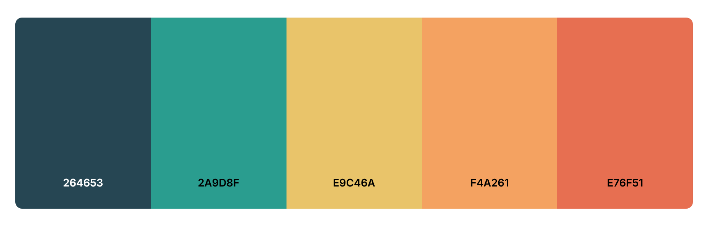
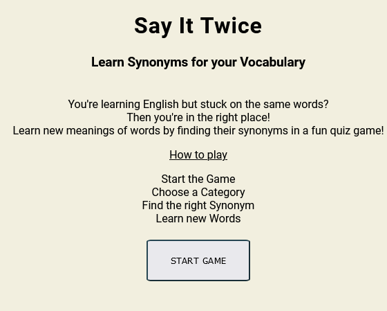
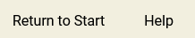
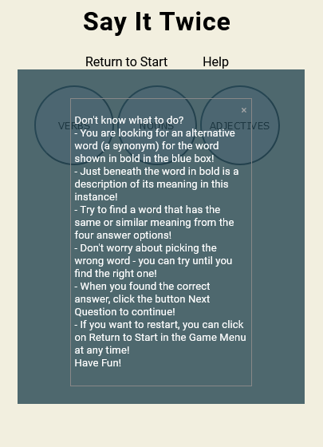
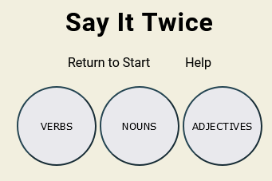
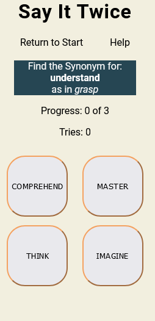
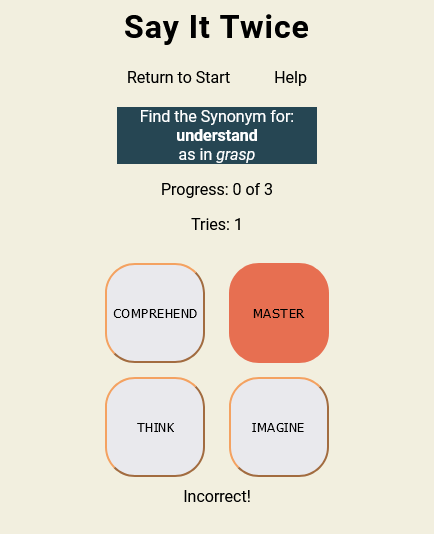
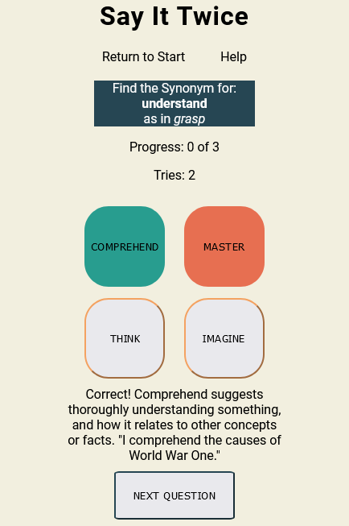
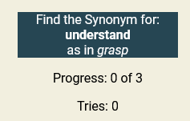
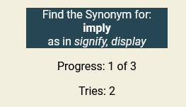

# Say It Twice

The Say It Twice website is an online quiz game to learn new words by finding synonyms for other words in English. Users can choose between learning verbs, nouns and adjectives and can progress through each category. Learning a new word is assisted by an explanation and example sentence, enhancing the overall learning experience.

The live link can be found here [Say It Twice](https://anchvo.github.io/pp2-synonym-quiz-game/).

## Requirements
This website was created as the second required project for the Diploma in Full Stack Software Development from [Code Insitute](https://codeinstitute.net). 

Basic requirements:
  - A static responsive website that incorporates the technologies JavaScript, HTML & CSS. 
  - Documentation and deployment via GitHub.
  - Readme.md documentation.
  - Manual and validator testing.

## UX

### Side Goals

- Provide information about what Say It Twice is and what you can do with it.
- Provide a learning experience with a learning outcome.
- Provide the option for users to learn something new in a fun way.
- Provide the option for users to learn at their own pace.

### User Demographic

This website is meant for:
  - Users who are actively learning English.
  - Users who are interested in enhancing their English vocabulary.
  - Users who like quiz games with a learning experience.

### User Experience

As a User:
  - I want to find out more about Say It Twice.
  - I want to understand how the quiz game works.
  - I want to be able to choose a category.
  - I want to be able to see my progress.
  - I want to be able to get help for how the quiz game works.
  - I want to be able to see if my answer is correct or not.
  - I want to get additional information about the correct answer.
  - I want to know when I finish a category or the game.
  - I want to be able to choose another category.

### User Goals

- Find information about Say It Twice.
- Understand how the quiz game works.
- Play the quiz game.
- Choose from different categories and work through them.
- Get help during the quiz game. 
- See my progress.
- Learn something and gain additional information while playing the quiz game. 

## Design

### Typography

- The font for the webpage was chosen for easy readability. The clear design also fits the content and purpose of the webpage, as its purpose is to learn and understand something. 
- The font used was taken from [Google Fonts](https.//fonts.google.com).

### Color

- The base color of a shade of beige was chosen in accordance to the content of the page and to relate to the color of paper, referencing words and learning.
- The colour palette was created with [Coolers](https://coolors.co) to ensure that they would compliment each other and have a good contrast. 
- The base color of the chosen color palette was slightly adjusted to make for a better background color.
- Additionally, the palette was picked to have more muted colors, especially in regards to the tones of red and green that are used to show if an answer was correct or not. As it is a learning game, the usually used bright colors in most games would not fit the content and purpose of the page.

## Features

- __Favicon__

 - Featured in the website tab along with the title, the included Favicon shows an open book to the theme of the website and the title.
 - The Favicon will allow the user to get a first idea of what the website is about and clarifies the title by showing what kind of Game Space they can expect.

- __Start Page__

- The start page is the landing page of the website and the first page the user sees when loading the page link.
- It inlcudes the title and a subtitle, that was chosen to immediately give the user a clear idea of what the page is about.
- The introduction paragraph states what the user can expect from the page - learning new words by finding synonyms in a quiz game - allowing the user to make a first choice if the page and the quiz game is what they are looking for.
- The start page also includes a short introduction for how the game is played, so the user knows what to expect.
- At the end, the user can click on a button that is titled Start Game, which will lead to the game being started.

- __Game Menu__

- The game menu is consistent for the continuation of the quiz game after clicking the start game button.
- It includes a simple Return to Start link that links back to the start page, allowing the user to stop and restart the game.
- A help link is also included which opens a modal with helpful hints in how to advance and finish the game.

- __Help Modal__

- The help modal includes instructions on how to advance the game after clicking the help link in the game menu.
- Rather than opening somewhere else on the page, the modal loads as an overlay over the game, displaying its contents on a slightly opaque background.
- This allows the user to check the help instructions even mid-game without disrupting the game at all.

- __Category Choice__

- The category choice is first display directly after starting the game via the start game button.
- It allows the user to pick a category of their choosing, either verbs, nouns or adjectives and then displays the corresponding questions after being clicked on.
- After finishing a category, the user can pick another category from the two remaining ones and after finishing two, they can pick the last one before ending the game.

- __Game Page__ 

- The game page displays the questions and answers for the category that has been chosen before.
- The page includes the question box, in which the question and a respective description is shown, that tells the user what he is looking for.
- Below the question box, the progress box shows the user his current progress in form of advancement in the number of questions and the number of tries to find the right answer.
- After, four different answers are shown in answer buttons, allowing the user to try and pick the correct one. 
- If chosen incorrectly, the answer button will turn red and an information will display, informing the user that the answer was incorrect.
- If chosen correctly, the answer button will turn green and an information will diplay, informing the user that the answer was correct and displaying a explanation and a example sentence for the correct answer.
- Additionally, if chosen correctly, a next question button will appear, allowing the user to advance to the next question.

  

- __Score Progress__

- The score progess starts at the beginning of the game when the first question is displayed.
- It tracks both the progress of the 3 questions of the current categories and the number of tries an answer was pressed before the correct one was chosen the the game was advanced.
- The number of tries will update immediately, as soon as an answer button is clicked. 
- When clicking the next question button, the category progress is updated. Both its new value and the number of tries are displayed with their new values on the next question.

  

- __Finished Category Page__

## Testing

### Validator Testing

### Bugs

## Deployment

- __The website was deployed to GitHub pages via the following steps:__
  - Log into GitHub.
  - Go to the GitHub repository and navigate to the settings tab.
  - Under the code and automation menu, select the Pages tab.
  - In the branch menu, select the main branch and the /root folder in the folder menu.
  - Save your options and wait until your project is deployed.
  - The live link should show up at the top of the GitHub Pages site after a reload.
  - It can also be accessed via the repository page : 
      - On the repository page, choose the link to github-pages under the Deployment tab in the left navigation bar. 
      - The live link is at the top of the newly openened Deployments page. 

  The live link can be found here:

## Credits

### Disclaimer

### Help, Advice and Inspiration

- Martina Terlevic - my wonderful mentor
- My sister

### Code

- Trouble-Shooting for bugs and learning about additional code options was assissted by using [W3Schools](https://www.w3schools.com/) and [MDN Web Docs](https://developer.mozilla.org/en-US/).

### Content
